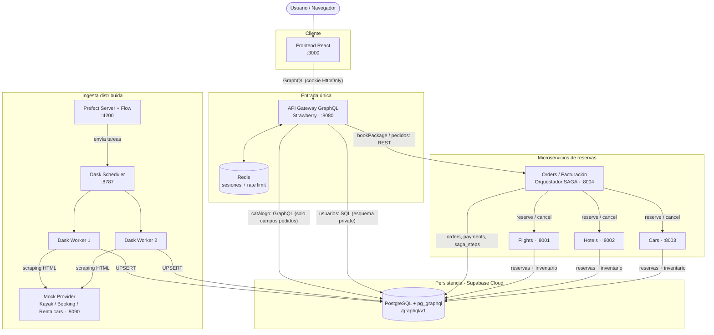
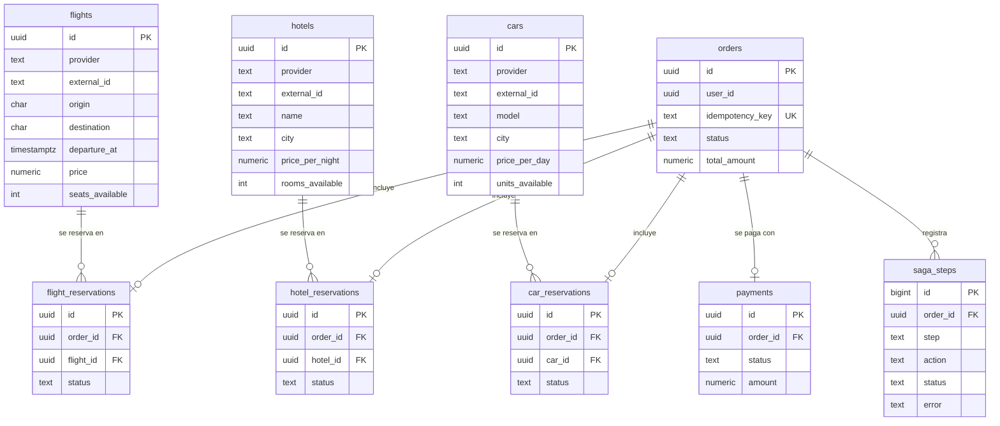
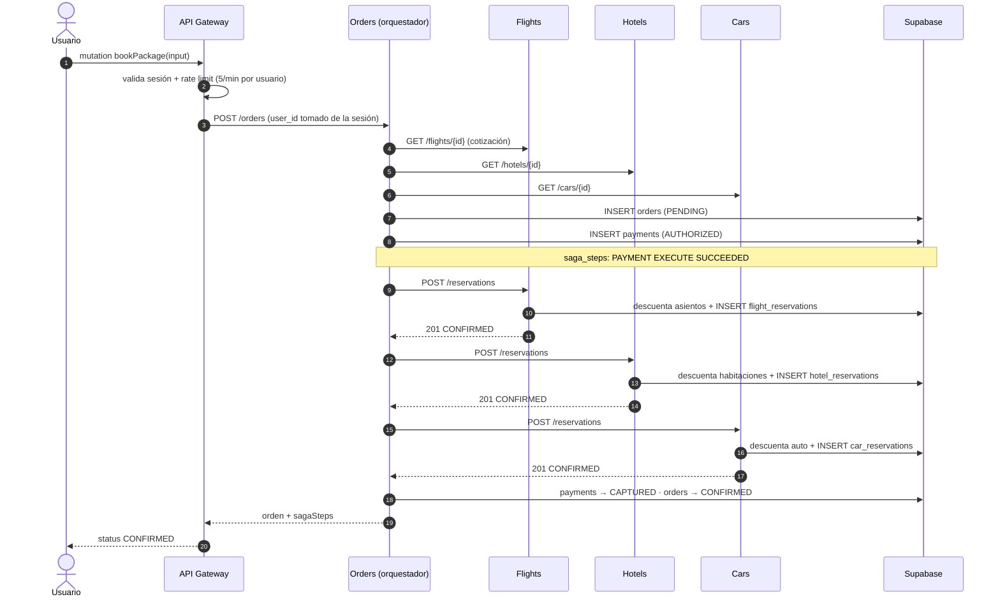
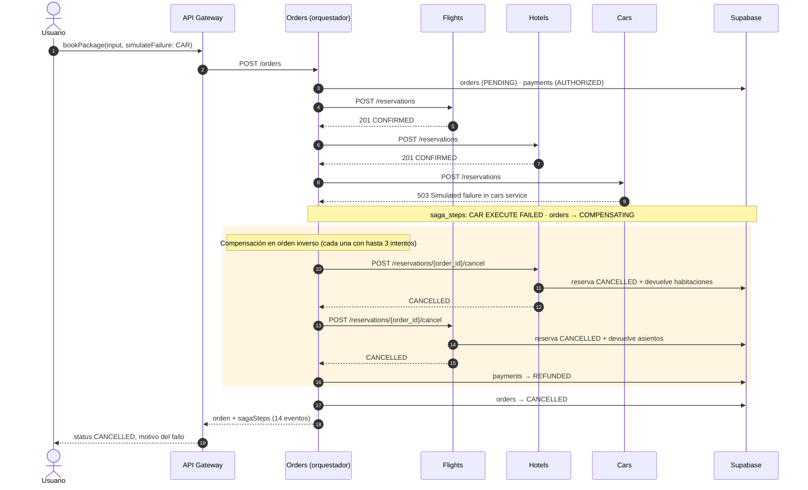
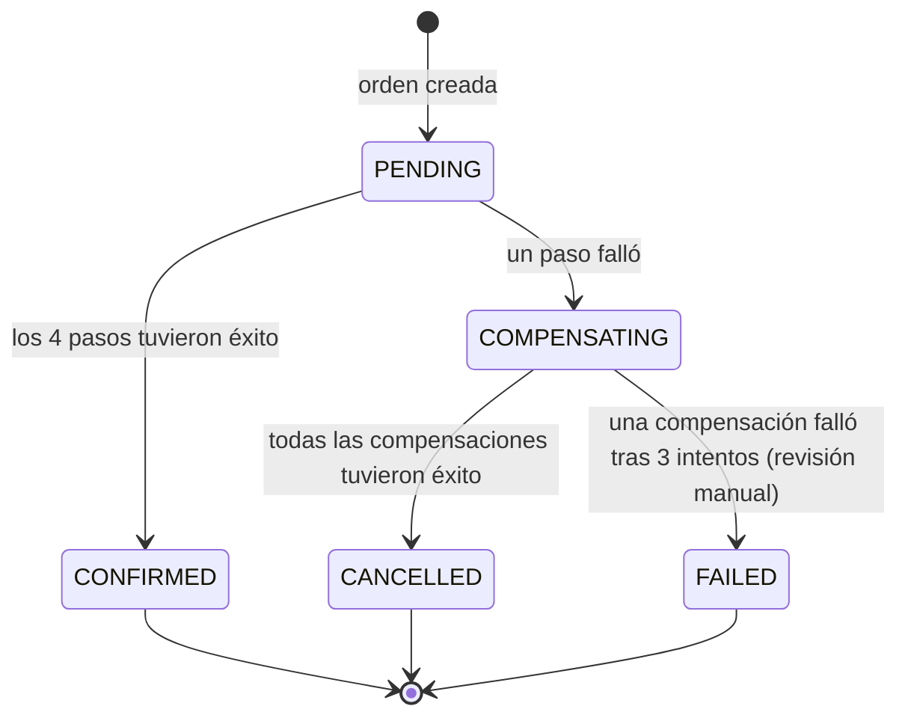
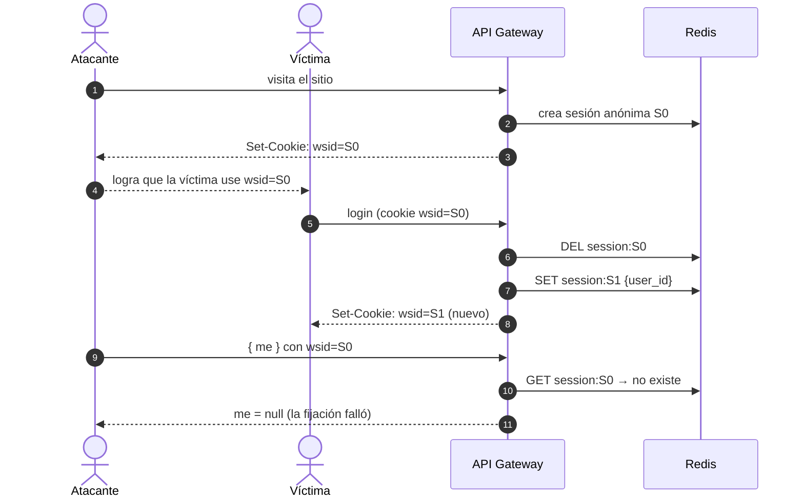

# WanderSync Travel Solutions — Documento Técnico de Arquitectura

**Asignatura:** Patrones Arquitectónicos Avanzados · **Evaluación:** Parcial Práctico del Segundo Corte
**Proyecto:** Plataforma de Empaquetamiento Turístico Dinámico

---

## Tabla de contenido

1. [Contexto y problema](#1-contexto-y-problema)
2. [Stack tecnológico](#2-stack-tecnológico)
3. [Arquitectura general](#3-arquitectura-general)
4. [Componentes y propiedad de datos](#4-componentes-y-propiedad-de-datos)
5. [Modelo de datos (Supabase)](#5-modelo-de-datos-supabase)
6. [Ingesta distribuida: Scraping + Dask + Prefect](#6-ingesta-distribuida-scraping--dask--prefect)
7. [API Gateway GraphQL](#7-api-gateway-graphql)
8. [Patrón SAGA](#8-patrón-saga)
9. [Ciberseguridad por diseño](#9-ciberseguridad-por-diseño)
10. [Despliegue con Docker Compose](#10-despliegue-con-docker-compose)
11. [Pruebas y evidencias](#11-pruebas-y-evidencias)
12. [Decisiones técnicas](#12-decisiones-técnicas)
13. [Limitaciones conocidas y trabajo futuro](#13-limitaciones-conocidas-y-trabajo-futuro)
14. [Guía de la demostración](#14-guía-de-la-demostración)

---

## 1. Contexto y problema

WanderSync vende paquetes turísticos que combinan **vuelo + hotel + auto** en una sola compra. La arquitectura anterior presentaba dos problemas:

| Problema | Consecuencia | Solución en este rediseño |
|---|---|---|
| **Reservas huérfanas**: el pago y el vuelo se confirmaban, pero el hotel o el auto fallaban en la red y no había reversión | Clientes cobrados por paquetes incompletos; datos inconsistentes | **Patrón SAGA orquestado** con compensaciones automáticas, idempotencia y recuperación tras caídas (§8) |
| **Sincronización masiva de tarifas** bloqueaba la persistencia y la red | Cuellos de botella y servicios principales bloqueados | **Ingesta asíncrona y distribuida** con Dask, orquestada y observada con Prefect (§6) |

Además, el sistema se diseñó con **seguridad desde el inicio** (§9): sesiones resistentes a *Session Fixation*, contraseñas con Argon2id, *rate limiting* y auditoría de dependencias.

---

## 2. Stack tecnológico

| Capa | Tecnología | Justificación |
|---|---|---|
| Frontend | React 18 + Vite 8 + Apollo Client, servido con nginx (no root) | Apollo permite consultas GraphQL declarativas que piden solo los campos que cada pantalla muestra |
| API Gateway | Python 3.12 + FastAPI + **Strawberry GraphQL** | Esquema tipado en Python, resolvers asíncronos (consultas en paralelo) y extensiones de seguridad (límites de profundidad y alias) |
| Microservicios | FastAPI + psycopg 3 (pool de conexiones) | Servicios pequeños y explícitos; SQL directo para operaciones atómicas de inventario |
| Persistencia | **Supabase** (PostgreSQL 15 + **pg_graphql**) | Base de datos moderna con GraphQL nativo (`/graphql/v1`), exigido por el enunciado (§3.3) |
| Sesiones / rate limiting | Redis 7 | Almacenamiento en memoria compartido por todas las réplicas del gateway; operaciones atómicas con Lua |
| Computación distribuida | **Dask** (1 scheduler + 2 workers) | Paraleliza el scraping, la limpieza y la carga sin bloquear los servicios principales |
| Orquestación / observabilidad | **Prefect 3** | Flujos con reintentos declarativos, programación periódica y panel visual |
| Contenedores | **Docker + Docker Compose** | Todo el ecosistema se levanta con `docker compose up` |

Se eligió **Python para todo el backend** porque Dask y Prefect son librerías de Python: un solo lenguaje reduce la complejidad y permite compartir patrones entre servicios.

---

## 3. Arquitectura general



**Flujo principal:**
1. El frontend solo se comunica con el **API Gateway GraphQL** (requisito §4.2).
2. Las búsquedas leen el catálogo desde **Supabase GraphQL (pg_graphql)**, reenviando únicamente los campos solicitados.
3. Las reservas (`bookPackage`) se delegan al **servicio de Órdenes**, que ejecuta la **SAGA** contra Flights, Hotels y Cars.
4. En segundo plano, **Prefect** programa cada 5 minutos un flujo que reparte el scraping entre los **workers de Dask** y actualiza el catálogo en Supabase.

---

## 4. Componentes y propiedad de datos

Cada microservicio es dueño exclusivo de sus tablas: ningún servicio escribe en las tablas de otro, se comunican por HTTP.

| Componente | Responsabilidad | Tablas que posee | Puerto |
|---|---|---|---|
| **frontend** | Interfaz web: login, búsqueda, checkout, detalle con línea de tiempo SAGA | — | 3000 |
| **gateway** | API GraphQL, autenticación, sesiones, rate limiting, autorización | `private.users` | 8080 |
| **orders-service** | Órdenes, pagos (facturación) y **orquestación SAGA** | `orders`, `payments`, `saga_steps` | 8004* |
| **flights-service** | Reserva y cancelación de asientos | `flight_reservations` (+ inventario de `flights`) | 8001* |
| **hotels-service** | Reserva y cancelación de habitaciones | `hotel_reservations` (+ inventario de `hotels`) | 8002* |
| **cars-service** | Reserva y cancelación de autos | `car_reservations` (+ inventario de `cars`) | 8003* |
| **pipeline** | Flujo Prefect de ingesta (corre al iniciar y cada 5 min) | `flights`, `hotels`, `cars`, `scrape_runs` | — |
| **dask-scheduler / dask-worker ×2** | Ejecución distribuida de las tareas del flujo | — | 8787 |
| **prefect-server** | API y panel de Prefect | — | 4200 |
| **mock-provider** | Sitio web simulado con fallos inyectados | — | 8090 |
| **redis** | Sesiones y contadores de rate limiting | — | interno |

\* Publicados solo en `127.0.0.1` para pruebas locales; el único punto de entrada público es el gateway.

---

## 5. Modelo de datos (Supabase)

Migración: [`supabase/migrations/20261003000000_wandersync_schema.sql`](../supabase/migrations/20261003000000_wandersync_schema.sql)



Además: `scrape_runs` (bitácora de cada ejecución de ingesta) y `private.users` (identidad, fuera de GraphQL).

**Decisiones del modelo:**

| Restricción | Propósito |
|---|---|
| `unique (provider, external_id)` en el catálogo | Permite **UPSERT**: cada scraping actualiza filas en vez de duplicarlas (y respeta los 500 MB del plan gratuito) |
| `unique (order_id)` en cada tabla de reservas y en `payments` | **Idempotencia**: si la SAGA reintenta un paso, nunca reserva dos veces |
| `unique (idempotency_key)` en `orders` | Un checkout enviado dos veces (doble clic, reintento de red) crea una sola orden |
| `check` de estados (`PENDING`, `CONFIRMED`, `COMPENSATING`, `CANCELLED`, `FAILED`) | Estados válidos garantizados por la base de datos |
| `check (password_hash like '$argon2id$%')` | La base de datos **rechaza** cualquier contraseña que no esté en Argon2id |
| Comentario `@graphql({"inflect_names": true})` | pg_graphql expone los campos en camelCase (`departureAt`), igual que el esquema del gateway |
| **RLS activado en todas las tablas, sin políticas**, y sin privilegios para `anon`/`authenticated` | La clave pública de Supabase no puede leer ni escribir nada; solo el backend (clave `service_role` o conexión directa) |
| Esquema `private` para `users` | pg_graphql nunca expone usuarios ni hashes de contraseña |

---

## 6. Ingesta distribuida: Scraping + Dask + Prefect

### 6.1 Fuente de datos

Se eligió una **fuente simulada** (`mock-provider`), permitida por el enunciado (§3.1), que reproduce la complejidad de Kayak, Booking y Rentalcars:

- Entrega **HTML renderizado en el servidor** (no JSON), por lo que el sistema realmente hace *scraping* con BeautifulSoup.
- Formatos inconsistentes a propósito: precios como `$1,234.50`, `USD 98.40` o `US$ 120.00 / night`; mayúsculas y espacios aleatorios; **filas duplicadas**.
- **Fallos de red inyectados**: 15 % de respuestas `503`/`429` y 5 % de respuestas más lentas que el *timeout* del scraper (8 s vs 5 s).
- Precios y disponibilidad cambian cada 5 minutos, mientras que el listado de vuelos/hoteles/autos es estable (permite el UPSERT).

### 6.2 Flujo Prefect sobre Dask

Código: [`pipeline/flows/ingest.py`](../pipeline/flows/ingest.py)

```mermaid
sequenceDiagram
    autonumber
    participant P as Prefect Flow<br/>ingest-travel-inventory
    participant S as Dask Scheduler
    participant W as Dask Workers (×2)
    participant M as Mock Provider
    participant DB as Supabase

    P->>DB: scrape_runs (RUNNING) por fuente
    P->>S: map(): 112 tareas de vuelos + 6 hoteles + 6 autos
    S->>W: distribuye las tareas en paralelo
    loop cada tarea (página)
        W->>M: GET /flights?origin=..&date=..
        alt 503 / 429 / timeout
            M-->>W: error
            Note over W: Prefect reintenta: 2 s, 5 s, 10 s (+ jitter)
            W->>M: reintento
        end
        M-->>W: HTML
        W->>W: parseo + limpieza + deduplicación
    end
    W-->>P: filas limpias
    P->>S: tarea load-to-supabase (por tabla)
    S->>W: ejecutar carga
    W->>DB: INSERT ... ON CONFLICT DO UPDATE (UPSERT)
    P->>DB: scrape_runs (SUCCEEDED/FAILED, intentos, filas)
```



| Aspecto | Implementación |
|---|---|
| Ejecución distribuida | `DaskTaskRunner(address="tcp://dask-scheduler:8786")`: cada página es una tarea en un worker |
| Reintentos | `retries=3`, `retry_delay_seconds=[2, 5, 10]`, `retry_jitter_factor=0.5` en cada tarea de scraping; la carga tiene `retries=2` |
| Tolerancia a fallos | Si una página falla tras todos los reintentos, el flujo continúa con las demás y lo registra en `scrape_runs.error` |
| Programación | `flow.serve(interval=300)`: el flujo corre al iniciar y luego cada 5 minutos |
| Observabilidad | Panel de Prefect (`:4200`): ejecuciones, estado de cada tarea, reintentos y logs. Panel de Dask (`:8787`): tareas por worker en tiempo real. Tabla `scrape_runs` en Supabase |
| Una sola imagen | Prefect server, scheduler, workers y el flujo usan la misma imagen, garantizando versiones idénticas (requisito de Dask) |

**Evidencia de la primera ejecución:**

| Fuente | Páginas | Intentos | Filas guardadas |
|---|---|---|---|
| Vuelos | 112 | 135 | 516 |
| Hoteles | 6 | 8 | 144 |
| Autos | 6 | 8 | 36 |

Los 135 intentos para 112 páginas muestran los **reintentos en acción**: ninguna página se perdió pese a los fallos inyectados.

---

## 7. API Gateway GraphQL

Código: [`gateway/app/schema.py`](../gateway/app/schema.py) · Explorador interactivo: `http://localhost:8080/graphql`

### 7.1 Esquema

| Tipo | Operación | Descripción |
|---|---|---|
| Query | `searchPackages(origin, destination, date, passengers)` | Vuelos en la fecha + hoteles y autos en el destino |
| Query | `me` | Usuario autenticado (o `null`) |
| Query | `myOrders` · `order(id)` | Órdenes del usuario, con pago y **línea de tiempo SAGA** |
| Mutation | `register` · `login` · `logout` | Gestión de cuenta y sesión |
| Mutation | `bookPackage(input)` | Ejecuta la SAGA de reserva (con `simulateFailure` opcional para la demo) |

### 7.2 Eliminación de over-fetching (de extremo a extremo)

1. El cliente pide solo lo que necesita, por ejemplo:
   ```graphql
   query {
     searchPackages(origin: "BOG", destination: "CTG", date: "2026-10-10") {
       flights { airline price }
     }
   }
   ```
2. Cada lista (`flights`, `hotels`, `cars`) tiene su propio *resolver*: si el cliente no pide `hotels`, **no se consulta** la tabla de hoteles.
3. El resolver lee los campos seleccionados (`info.selected_fields`) y construye la consulta a **pg_graphql pidiendo solo esas columnas**:
   ```graphql
   { flightsCollection(filter: {...}, orderBy: [{price: AscNullsLast}], first: 10) {
       edges { node { airline price } } } }
   ```
4. Los tres resolvers son asíncronos, así que vuelos, hoteles y autos se consultan **en paralelo**.

Los nombres de campos se validan contra una lista blanca derivada del esquema, y los valores se escapan como literales JSON: la entrada del usuario no puede alterar la consulta.

---

## 8. Patrón SAGA

Código: [`services/orders/app/saga.py`](../services/orders/app/saga.py)

### 8.1 ¿Orquestación o coreografía?

Se eligió **orquestación**: el servicio de Órdenes dirige los pasos y decide las compensaciones.

| Criterio | Orquestación (elegida) | Coreografía |
|---|---|---|
| Visibilidad del flujo | Todo el flujo está en un solo lugar (`saga.py`) | Repartido entre servicios que reaccionan a eventos |
| Infraestructura | Solo HTTP | Requiere un *broker* de mensajes |
| Auditoría | Cada paso queda en `saga_steps` | Hay que reconstruir el flujo desde eventos |
| Demostración | La línea de tiempo se muestra directamente | Más difícil de seguir |

### 8.2 Pasos y compensaciones

| Orden | Paso | Acción | Compensación |
|---|---|---|---|
| 1 | `PAYMENT` | Autorizar el pago (`payments.status = AUTHORIZED`) | Reembolso (`REFUNDED`) |
| 2 | `FLIGHT` | `POST flights-service/reservations` (descuenta asientos) | `POST .../reservations/{order_id}/cancel` (devuelve asientos) |
| 3 | `HOTEL` | `POST hotels-service/reservations` (descuenta habitaciones) | `POST .../cancel` (devuelve habitaciones) |
| 4 | `CAR` | `POST cars-service/reservations` (descuenta un auto) | `POST .../cancel` (devuelve el auto) |
| — | Éxito | Captura del pago (`CAPTURED`) y orden `CONFIRMED` | — |

Si un paso falla, se compensan **en orden inverso** solo los pasos ya completados.

### 8.3 Diagrama de secuencia — camino exitoso (happy path)



### 8.4 Diagrama de secuencia — fallo y compensación (falla el auto)



### 8.5 Estados de una orden



### 8.6 Garantías de consistencia

| Mecanismo | Cómo funciona |
|---|---|
| **Compensación automática** | Sin intervención manual: el orquestador deshace los pasos completados en orden inverso |
| **Reintento de compensaciones** | Cada compensación se intenta hasta 3 veces con espera creciente (1 s, 2 s); si aun así falla, la orden queda `FAILED` para revisión |
| **Idempotencia de pasos** | `reserve` con un `order_id` ya confirmado devuelve la reserva existente; `cancel` sobre algo ya cancelado responde `NOTHING_TO_CANCEL`. Así los reintentos son seguros |
| **Idempotencia del checkout** | El frontend envía un `idempotencyKey` por intento de compra; repetirlo devuelve la misma orden sin ejecutar otra SAGA |
| **Operaciones atómicas de inventario** | `UPDATE ... SET seats_available = seats_available - n WHERE seats_available >= n` dentro de una transacción: nunca se sobrevende |
| **Recuperación tras caídas** | Al iniciar, el servicio de Órdenes busca órdenes `PENDING`/`COMPENSATING` con más de 1 minuto y compensa los pasos iniciados y no deshechos, eliminando las **reservas huérfanas** |
| **Auditoría** | Cada ejecución y compensación queda registrada en `saga_steps` (paso, acción, estado, error, hora) |
| **Fallos reales** | `simulateFailure` hace que el **servicio remoto** responda `503`; el orquestador no "finge" el fallo |

---

## 9. Ciberseguridad por diseño

### 9.1 Gestión segura de sesiones — mitigación de Session Fixation

Código: [`gateway/app/sessions.py`](../gateway/app/sessions.py)

- Sesiones **del lado del servidor** en Redis; el navegador solo guarda un identificador aleatorio de 256 bits (`secrets.token_urlsafe(32)`) en la cookie `wsid`.
- Todo visitante recibe primero una **sesión anónima**. Al hacer **login** (y también al registrarse o cerrar sesión), ese identificador **se destruye y se emite uno nuevo**.
- Un identificador "plantado" por un atacante antes del login queda inservible después.



| Control de la cookie / sesión | Valor |
|---|---|
| `HttpOnly` | JavaScript no puede leer la cookie (mitiga robo por XSS) |
| `SameSite=Lax` | No se envía en peticiones POST entre sitios (mitiga CSRF) |
| `Secure` | Configurable (`COOKIE_SECURE=true` cuando se sirve por HTTPS) |
| Expiración por inactividad | 30 minutos (ventana deslizante) |
| Vida máxima | 8 horas |

### 9.2 Almacenamiento de contraseñas — Argon2id

Código: [`gateway/app/auth.py`](../gateway/app/auth.py)

- **Argon2id** con `argon2-cffi`: memoria 64 MiB, 3 iteraciones, paralelismo 4 (perfil de baja memoria del RFC 9106). Ejemplo almacenado: `$argon2id$v=19$m=65536,t=3,p=4$...`
- El hash se calcula en un hilo aparte para no bloquear el servidor.
- **Rehash automático** si en el futuro se suben los parámetros (`check_needs_rehash`).
- La base de datos rechaza hashes que no sean Argon2id (restricción `check`).
- Contraseñas de 10 a 128 caracteres.
- **Tiempo constante**: si el email no existe, igual se verifica un hash ficticio para que el tiempo de respuesta no revele qué cuentas existen.
- **Bloqueo de cuenta**: 5 contraseñas incorrectas bloquean la cuenta 15 minutos.

### 9.3 Rate limiting

Código: [`gateway/app/ratelimit.py`](../gateway/app/ratelimit.py)

Algoritmo de **ventana deslizante** en Redis, ejecutado como un único script Lua atómico (dos peticiones simultáneas no pueden superar el límite). A diferencia de una ventana fija, no permite ráfagas dobles en el cambio de minuto.

| Ruta sensible | Límite | Clave |
|---|---|---|
| `login` | 5 intentos / 60 s | IP |
| `login` | 10 intentos / 15 min | cuenta (email) |
| `register` | 3 registros / 10 min | IP |
| `bookPackage` (checkout y pago) | 5 / 60 s | usuario |
| Cualquier petición a `/graphql` | 120 / 60 s | IP (respuesta HTTP 429 + `Retry-After`) |

La IP se toma del socket (`--no-proxy-headers`), no de cabeceras que el cliente podría falsificar.

### 9.4 Otros controles

| Control | Implementación |
|---|---|
| Autorización (IDOR) | `user_id` siempre sale de la sesión; un usuario no puede ver órdenes ajenas (se responden igual que inexistentes) |
| Abuso de GraphQL | `QueryDepthLimiter(6)` y `MaxAliasesLimiter(15)` (evita, por ejemplo, 100 logins en una sola petición) |
| Enmascaramiento de errores | Los errores internos se muestran como "Unexpected error"; solo los errores de negocio llegan al cliente |
| CORS | Solo el origen del frontend, con credenciales |
| Cabeceras HTTP del frontend | `Content-Security-Policy`, `X-Frame-Options: DENY`, `X-Content-Type-Options: nosniff`, `Referrer-Policy`, `Permissions-Policy` |
| Contenedores | Todos los servicios propios corren con usuario **no root**; nginx en imagen *unprivileged* |
| Red | Puertos de microservicios solo en `127.0.0.1`; Redis sin puerto publicado y con contraseña |
| Base de datos | RLS en todas las tablas; usuarios en esquema `private`; la clave pública no tiene acceso |
| Secretos | En `.env`, ignorado por Git; se publica solo `.env.example` |

### 9.5 Seguridad de la cadena de suministro

Script: [`scripts/security-audit.sh`](../scripts/security-audit.sh) · Reportes: [`docs/security/`](security/README.md)

- **pip-audit** se ejecuta *dentro de cada imagen construida* (audita lo realmente instalado, no solo `requirements.txt`).
- **npm audit** sobre el `package-lock.json` del frontend.

| Componente | Primera auditoría | Corrección | Resultado final |
|---|---|---|---|
| 7 imágenes Python | `pip 25.0.1` (heredado de la imagen base): 12 entradas de vulnerabilidad | `pip install --upgrade pip` en cada Dockerfile | Sin vulnerabilidades conocidas |
| Frontend | 4 vulnerabilidades (1 alta, 3 moderadas): `react-router` (GHSA-wrjc-x8rr-h8h6, GHSA-337j-9hxr-rhxg) y `esbuild`/`vite` (GHSA-67mh-4wv8-2f99) | `react-router-dom` 7.18.4 y `vite` 8 | 0 vulnerabilidades |

Ninguna librería de la aplicación (FastAPI, Strawberry, psycopg, Prefect, Dask…) tenía vulnerabilidades conocidas.

---

## 10. Despliegue con Docker Compose

### 10.1 Requisitos

- Docker con Docker Compose v2.
- Un proyecto de Supabase con la migración ejecutada (SQL Editor → pegar `supabase/migrations/...sql` → Run).

### 10.2 Configuración

Copiar `.env.example` a `.env` y completar:

| Variable | Origen |
|---|---|
| `SUPABASE_URL` | Supabase → Project Settings → API |
| `SUPABASE_SERVICE_KEY` | Supabase → Project Settings → API (clave `service_role` / secreta) |
| `DATABASE_URL` | Supabase → Connect → **Session pooler** (IPv4; el plan gratuito no ofrece IPv4 en conexión directa) |
| `REDIS_PASSWORD` | Cualquier cadena larga aleatoria |

### 10.3 Ejecución

```bash
docker compose up --build -d
```

Se levantan **13 contenedores**:

| URL | Servicio |
|---|---|
| http://localhost:3000 | Frontend |
| http://localhost:8080/graphql | API Gateway (explorador GraphiQL) |
| http://localhost:4200 | Panel de Prefect |
| http://localhost:8787 | Panel de Dask |
| http://localhost:8090 | Sitio simulado (fuente de scraping) |

Todos los servicios tienen *healthchecks* y `depends_on` con `condition: service_healthy`, por lo que arrancan en el orden correcto sin intervención manual.

---

## 11. Pruebas y evidencias

| Prueba | Cómo ejecutarla | Resultado |
|---|---|---|
| Ingesta Dask + Prefect | Panel de Prefect / `select * from scrape_runs` | 124 páginas por ejecución, reintentos visibles, 696 filas |
| SAGA por consola | `docker compose exec orders-service python -m app.demo [CAR\|HOTEL\|FLIGHT\|PAYMENT]` | Camino exitoso `CONFIRMED`; fallo `CANCELLED` con compensaciones |
| Fallo en cada paso | Igual, cambiando el paso | PAYMENT → nada que deshacer · FLIGHT → reembolso · HOTEL → vuelo + reembolso · CAR → hotel + vuelo + reembolso |
| Consistencia | Pruebas manuales de casos límite | Checkout duplicado = 1 orden · inventario restaurado tras compensar · doble cancelación inofensiva |
| Gateway de extremo a extremo | `docker compose exec -T gateway python - < scripts/test_gateway.py` | **21/21 verificaciones** (búsqueda, session fixation, Argon2id, SAGA, autorización, rate limits, alias) |
| Auditoría de dependencias | `./scripts/security-audit.sh` | 8/8 componentes sin vulnerabilidades conocidas |

---

## 12. Decisiones técnicas

| # | Decisión | Alternativas consideradas | Motivo |
|---|---|---|---|
| D1 | Python en todo el backend | Node.js para el gateway | Dask y Prefect son de Python; un solo lenguaje |
| D2 | SAGA **orquestada** | Coreografía con eventos | Flujo visible, sin broker, auditoría directa (§8.1) |
| D3 | Supabase Cloud (plan gratuito) | Supabase autoalojado | El autoalojado requiere ~10 contenedores más; Cloud ofrece pg_graphql listo y panel para la demo |
| D4 | Fuente de datos simulada | Scraping de Kayak/Booking reales | Permitido por el enunciado; evita bloqueos y términos de uso, y permite inyectar fallos controlados para demostrar los reintentos |
| D5 | Gateway lee el catálogo vía pg_graphql y los usuarios vía SQL | Todo por pg_graphql | El catálogo aprovecha GraphQL nativo; los usuarios quedan fuera de GraphQL por seguridad |
| D6 | Sesiones en servidor (Redis) | JWT en el navegador | Permite destruir y regenerar el identificador (requisito de Session Fixation) y revocar sesiones al instante |
| D7 | Ventana deslizante en Lua | Ventana fija; librería `slowapi` | Las pruebas demostraron que la ventana fija dejaba pasar ráfagas en el cambio de minuto; `slowapi` limita por ruta y GraphQL tiene una sola ruta |
| D8 | Una imagen para Prefect + Dask | Imágenes separadas | Dask exige versiones idénticas en cliente, scheduler y workers |
| D9 | Pool de conexiones pequeño por servicio | Pools grandes | El *pooler* de Supabase gratuito tiene pocas conexiones |

---

## 13. Limitaciones conocidas y trabajo futuro

| Limitación | Impacto | Mejora propuesta |
|---|---|---|
| El scraper sobrescribe la disponibilidad (`seats_available`, etc.) cada 5 minutos | El inventario descontado por reservas se "repone" con el dato del proveedor (que se considera la fuente de verdad) | Llevar las reservas propias en una tabla aparte y restarlas de la disponibilidad del proveedor |
| La SAGA corre dentro de la petición HTTP | Una reserva tarda unos segundos; la petición espera | Ejecutar la SAGA en segundo plano y notificar al frontend (polling o WebSocket) |
| Si un `cancel` llega antes de que un `reserve` lento termine, la reserva puede quedar viva | Caso raro de carrera ante *timeouts* | Registrar una "lápida" de cancelación por `order_id` que bloquee reservas posteriores |
| Recuperación tras caídas y bloqueo de cuenta | Implementados, sin prueba automatizada | Añadir pruebas que detengan el orquestador a mitad de una SAGA y que verifiquen el bloqueo |
| Supabase gratuito pausa el proyecto tras ~7 días sin uso | La primera petición tras la pausa falla | Abrir el panel de Supabase antes de la demostración |
| HTTP local sin TLS | `COOKIE_SECURE=false` | En producción, servir por HTTPS y activar `COOKIE_SECURE=true` |

---

## 14. Guía de la demostración

Antes de grabar: `docker compose up -d` y esperar que todos los contenedores estén *healthy* (`docker compose ps`).

| Parte | Qué mostrar | Dónde |
|---|---|---|
| **(a)** Prefect monitoreando flujos | Deployment `scheduled-ingestion`, una ejecución completada, tareas con **reintentos** (estado *AwaitingRetry*) y sus logs. Lanzar una ejecución con **Quick run** | http://localhost:4200 |
| **(b)** Tareas distribuidas en Dask | Durante esa ejecución: barras de tareas repartidas entre los 2 workers (*Status* y *Workers*) | http://localhost:8787 |
| **(c)** Frontend consumiendo GraphQL | Crear cuenta, buscar Bogotá → Cartagena, elegir vuelo + hotel + auto, reservar → orden `CONFIRMED`. Opcional: pestaña *Network* del navegador mostrando las peticiones a `/graphql` | http://localhost:3000 |
| **(d)** Fallo transaccional con compensación SAGA | Reservar de nuevo con **"Demo: simulate a failure" → Fail at car**: Payment, Flight y Hotel aparecen como *Undone*, Car como *Failed*, y el registro de eventos muestra las compensaciones en orden inverso. Mostrar también `saga_steps` en Supabase | Frontend + Supabase |

Puntos extra para la sustentación: mostrar en el navegador (*DevTools → Application → Cookies*) que el valor de `wsid` **cambia** al hacer login (Session Fixation), y ejecutar `./scripts/security-audit.sh` o abrir `docs/security/README.md`.
